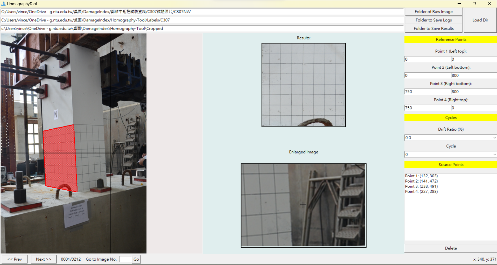

Homography-Tool
===============

A simple tool for transforming images using homography, implemented with Python Tkinter.

**Screenshot:**


Data Organization
-----------------
LabelTool  
|  
|--main.py   *# source code for the tool*  
|  
|--Images/   *# direcotry containing the images to be labeled*  


Environment
----------
```
▶ conda env create -f environment.yaml
▶ conda activate homography
```

Run
-------
```
▶ python3 main.py
```

Usage
-----
1. The current tool requires that :
   * The input images dir.
   * The output labels dir.
   * The output cropped images dir.
   * You can choose those dir by button `Folder of Raw Image`,  `Folder to Save Logs`, and `Folder to Save Results`, or input dir name in entry.
2. Click `Load Dir`. The images to be labeled in the folder, along with an example results will be loaded. The labeled file directory will automatically created if it does not  exist.
3. To create a new polygon, left-click to select all the points. Moving the mouse to select four vertex..
  - To cancel the polygon while drawing, just press `<Esc>`.
  - To delete a existing polygon,  click `Delete`.
4. After finishing one image, click `Next` to advance. Likewise, click `Prev` to reverse. Or, input an image id and click `Go` to navigate to the speficied image.
  - Be sure to click `Next` after finishing a image, or the result won't be saved. 
  - press 'a' to go prev image.
  - press 'd' to go next image.

5. Support multiple image formats: `"*.JPEG", "*.jpeg", "*JPG", "*.jpg", "*.PNG", "*.png", "*.BMP", "*.bmp"`.


